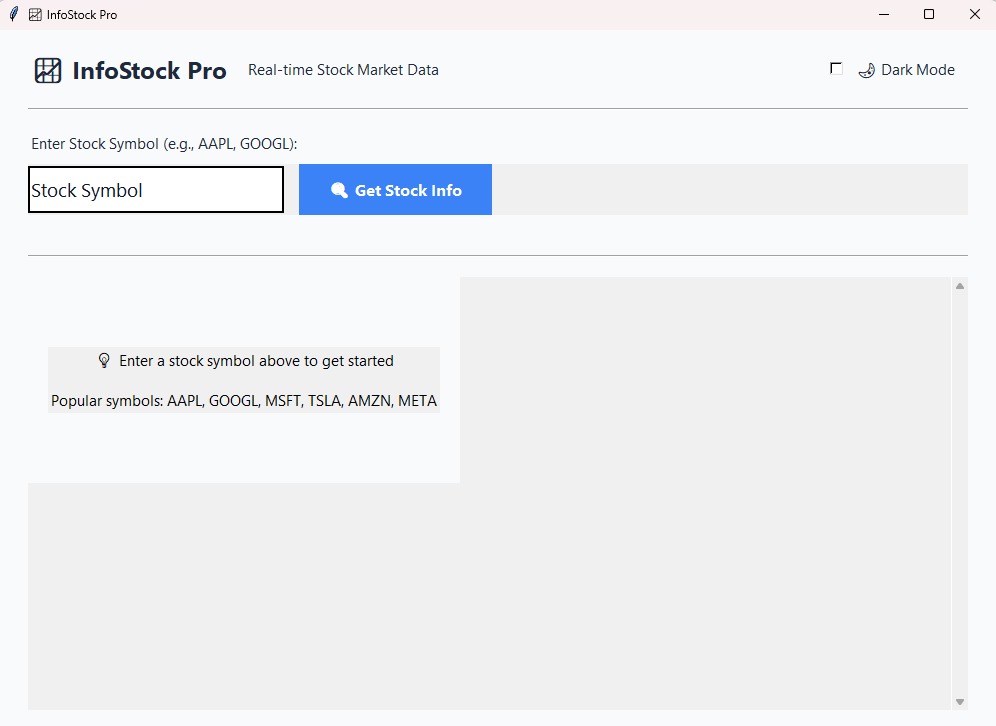
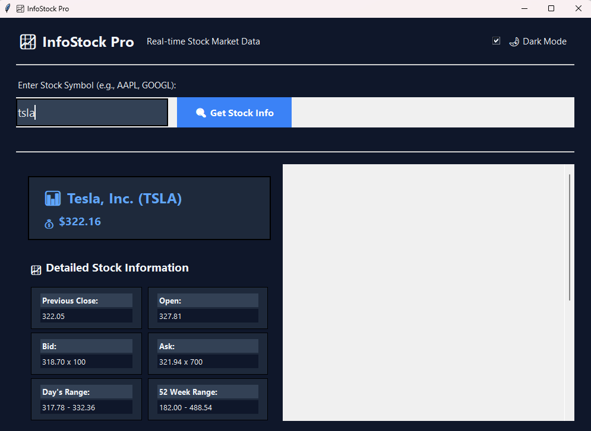

# 📈 InfoStock Pro

InfoStock Pro is a sleek and modern desktop application that provides real-time stock market data. With a clean user interface built with Python and Tkinter, it allows users to quickly look up detailed information for any stock symbol listed on Yahoo Finance. The application features both light and dark modes for a comfortable viewing experience.

## 📸 Screenshots

| Light Mode | Dark Mode |
| :---: | :---: |
|  |  |
| Main application view in light mode. | Main application view in dark mode. |

## ✨ Key Features

- **Real-Time Data:** Fetches the latest stock data directly from Yahoo Finance.
- **Detailed Information:** Displays the current price, company name, and a comprehensive list of key metrics.
- **Modern GUI:** An intuitive and aesthetically pleasing graphical user interface built with Tkinter.
- **Dual Theme:** Easily switch between **Light** and **Dark** modes.
- **Enhanced User Experience:** Includes loading animations, button hover effects, and error handling.
- **Responsive Design:** The interface adapts to different window sizes and adds a scrollbar when content overflows.

## 🛠️ Tech Stack

- **Python:** The core programming language.
- **Tkinter:** Python's standard library for creating the GUI.
- **Requests:** For making HTTP requests.
- **Beautiful Soup (bs4):** For web scraping and parsing HTML content.
- **lxml:** The efficient HTML parser used by Beautiful Soup.

## 🚀 Getting Started

Follow these instructions to get a local copy of the project up and running.

### Prerequisites

Make sure you have Python 3 installed on your system.

- [Download Python](https://www.python.org/downloads/)

### Installation

1.  **Clone the repository:**
    ```sh
    git clone [https://github.com/SimonDevJS/infostock.git](https://github.com/SimonDevJS/infostock.git)
    cd infostock
    ```

2.  **Create a virtual environment (recommended):**
    ```sh
    # For Windows
    python -m venv venv
    venv\Scripts\activate

    # For macOS/Linux
    python3 -m venv venv
    source venv/bin/activate
    ```

3.  **Install dependencies:**
    The repository already includes a `requirements.txt` file. Install the dependencies using pip:
    ```sh
    pip install -r requirements.txt
    ```

4.  **Run the application:**
    ```sh
    python infostock.py
    ```

## 📖 How to Use

1.  Launch the application.
2.  Enter a stock symbol (e.g., `AAPL`, `GOOGL`, `TSLA`).
3.  Click the **"🔍 Get Stock Info"** button or press `Enter`.
4.  Use the **"🌙 Dark Mode"** toggle switch to change themes.
5.  If the data list is long, use the mouse wheel or the scrollbar to navigate.

## ⚠️ Disclaimer

- This application scrapes the Yahoo Finance website. Any changes to the HTML structure of their website may cause the application to stop working.
- The data provided is for informational purposes only and should not be considered financial advice.

## 🤝 Contributing

Contributions are what make the open-source community such an amazing place to learn, inspire, and create. Any contributions you make are **greatly appreciated**.
